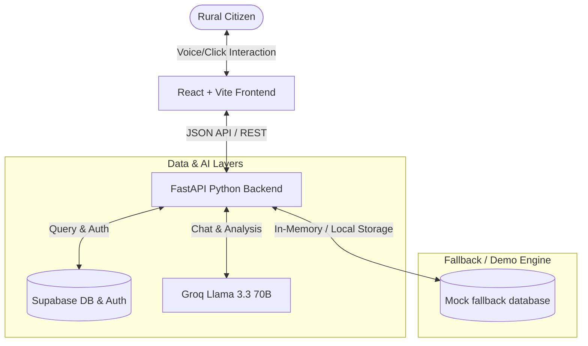
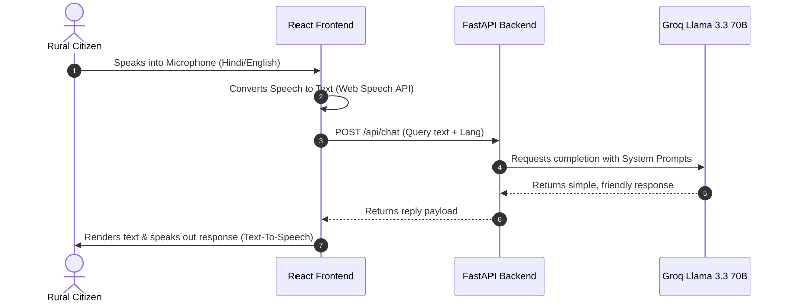
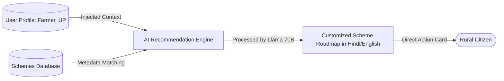

# GramSathi AI
> **Empowering Every Village, One Click at a Time.**

GramSathi AI is a digital platform designed as a **Digital Village Operating System** to solve rural accessibility challenges. It provides a simple, multilingual, and voice-enabled gateway for rural citizens to access government schemes, local business directories, clinics, classrooms, notice boards, and emergency hotlines.

---

## 🏗️ System Architecture



---

## 🔄 Workflow Diagram



---

## 📊 Data Flow Diagram



---

## ✨ Features
1. **Government Schemes**: Search and filter central/state schemes. Instant eligibility checks and AI-powered recommendations based on user occupation.
2. **Healthcare Portal**: Live directory of nearby clinics, medicine notifications, vaccination trackers, and daily wellness tips.
3. **Digital Education**: Directory of schools, available scholarships, career paths, and short vocational training lessons.
4. **Local Shops Directory**: Village market listings for farmers, tailors, mechanics, electricians, and women entrepreneurs.
5. **Interactive Village Map**: Leaflet.js canvas mapping primary community coordinates (Panchayat, school, water pump).
6. **AI Voice Assistant**: Complete hands-free microphone input and audio playback support in English and Hindi.
7. **Notice Board**: Categorized Gram Sabha notices (electricity cuts, water supply notices, health camps).
8. **Offline Mode Capability**: Caches schemes and emergency contact details for offline access when network drops.

---

## 💡 Innovation & Unique Selling Points (USPs)
* **Voice-First Design**: Solves typing challenges for elderly or neo-literate citizens.
* **Dual-Language Dynamic Translation**: Dynamic switches for all labels between English and Hindi.
* **Dual-Mode Architectural Fallbacks**: Runs instantly without keys using mock layers, and connects to live production services seamlessly when environment variables are supplied.
* **PostgreSQL pgvector ready**: Relational database schema enables location-based business matching and semantic schemes matching.

---

## 📈 Impact & Scalability Analysis
* **Impact**: Empowers rural families by bypass middlemen. Increases vaccine awareness and links local craftsmen to neighboring customers.
* **Scalability**: Python FastAPI is asynchronous, and Supabase scales on PostgreSQL. The lightweight index sizes and offline caching limit cellular data consumption in remote environments.

---

## 🚀 Quick Start Instructions

### 1. Clone & Set Environment Variables
Create a `.env` file in the root:
```env
GROQ_API_KEY=your_groq_api_key_here
SUPABASE_URL=your_supabase_project_url
SUPABASE_ANON_KEY=your_supabase_anon_key
```

### 2. Run Backend (FastAPI)
```bash
cd backend
python -m venv venv
# On Windows:
venv\Scripts\activate
pip install -r requirements.txt
python main.py
```
*API will run on `http://127.0.0.1:8000`*

### 3. Run Frontend (React + Vite)
In another terminal:
```bash
cd frontend
npm install
npm run dev
```
*Frontend will run on `http://localhost:5173`*
